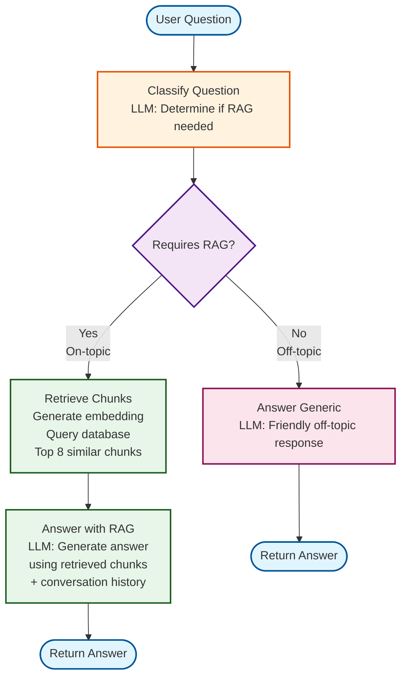

# ISAT RAG Chatbot - LangGraph Workflow

## Workflow Description

### 1. **Classify Question**
- Uses GPT-4o-mini to determine if the question requires RAG
- On-topic: ISAT program, courses, curriculum, labs, careers, concentrations
- Off-topic: Unrelated topics or questions not requiring JMU/ISAT knowledge

### 2. **Retrieve Chunks** (RAG Path)
- Generates embedding for user question using `text-embedding-3-small`
- Queries database for top 8 most similar chunks
- Includes course information and similarity scores

### 3. **Answer with RAG**
- Builds context from retrieved chunks
- Uses GPT-4o-mini to generate answer based on retrieved context
- Includes conversation history (last 10 exchanges)
- Cites sources and provides links when possible

### 4. **Answer Generic** (Off-topic Path)
- Uses GPT-4o-mini for friendly generic response
- Mentions focus on ISAT-related questions
- Includes conversation history for context

## State Management

The workflow maintains state through `GraphState`:
- `question`: User's input question
- `requires_rag`: Boolean flag from classification
- `chunks`: Retrieved chunks from database (RAG path)
- `answer`: Final generated answer
- `conversation_history`: Previous Q&A pairs for context

